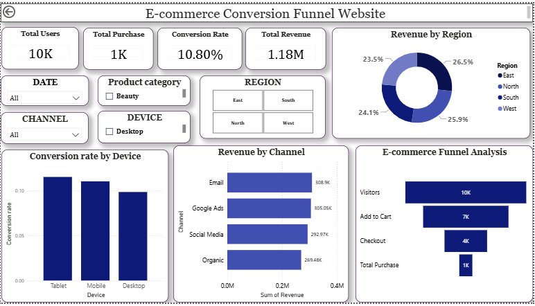
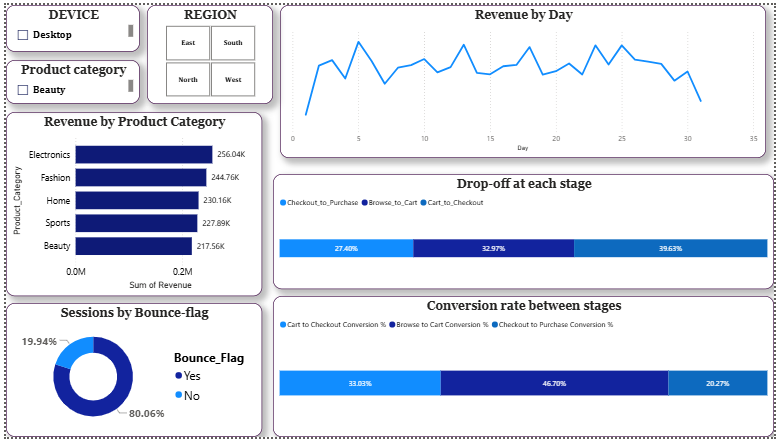

# 🛒 E-commerce Conversion Funnel Analysis Dashboard

## 📊 Project Overview

This project focuses on analyzing an **e-commerce conversion funnel** to understand how users move from visiting a website to completing a purchase.

The dashboard was developed in **Microsoft Power BI** to track user behavior, measure conversion rates, identify drop-offs between funnel stages, and analyze revenue across different dimensions such as **device, region, channel, product category, and day**.

The objective is to transform raw e-commerce event data into an **interactive business intelligence dashboard** that helps identify areas where users are lost during the purchasing journey.

---

## 🎯 Project Objectives

The primary objectives of this project are:

* Analyze the complete e-commerce conversion funnel
* Measure users at each stage of the funnel
* Calculate conversion rates between stages
* Identify major drop-off points
* Analyze revenue performance
* Compare conversion rates across devices
* Analyze revenue by marketing channel
* Analyze revenue by region
* Compare revenue across product categories
* Understand daily revenue trends
* Analyze bounce behavior
* Provide actionable insights for improving conversions

---

## 🔄 E-commerce Funnel

The dashboard follows four major stages:

```text
Visitors
   ↓
Add to Cart
   ↓
Checkout
   ↓
Purchase
```

### Funnel Performance

| Funnel Stage   | Users |
| -------------- | ----: |
| 👥 Visitors    |   10K |
| 🛒 Add to Cart |    7K |
| 💳 Checkout    |    4K |
| 🛍️ Purchase   |    1K |

The funnel visualization makes it easier to identify where the largest number of users leave the purchasing journey.

---

## 📈 Key KPIs

The dashboard provides high-level KPIs for monitoring overall performance:

| KPI                         |  Value |
| --------------------------- | -----: |
| **Total Users**             |    10K |
| **Total Purchases**         |     1K |
| **Overall Conversion Rate** | 10.80% |
| **Total Revenue**           |  1.18M |

These KPIs provide a quick overview of the overall health of the e-commerce funnel.

---

# 🖥️ Dashboard Pages

## 📄 Page 1 — E-commerce Funnel Overview

The first dashboard page provides a high-level overview of website performance.

### Visualizations Included

* **Total Users**
* **Total Purchases**
* **Conversion Rate**
* **Total Revenue**
* **Revenue by Region**
* **Conversion Rate by Device**
* **Revenue by Channel**
* **E-commerce Funnel Analysis**

### 🔍 Filters

Users can interact with the dashboard using filters for:

* Date
* Product Category
* Region
* Channel
* Device

This allows the funnel to be analyzed dynamically across different customer segments.

# Preview

---

## 📄 Page 2 — Detailed Funnel & Revenue Analysis

The second page provides deeper insights into revenue and funnel performance.

### Visualizations Included

* **Revenue by Day**
* **Revenue by Product Category**
* **Sessions by Bounce Flag**
* **Drop-off at Each Stage**
* **Conversion Rate Between Stages**

### 📊 Product Category Revenue

The dashboard compares revenue across:

* Electronics
* Fashion
* Home
* Sports
* Beauty

### 📱 Device Analysis

Conversion rates are compared across:

* Tablet
* Mobile
* Desktop

### 📢 Channel Analysis

Revenue is analyzed across:

* Email
* Google Ads
* Social Media
* Organic

---

# 🚨 Funnel Drop-off Analysis

One of the main objectives of the project is identifying **bottlenecks in the customer journey**.

The dashboard measures drop-off between:

```text
Browse → Add to Cart
Add to Cart → Checkout
Checkout → Purchase
```

The displayed drop-off percentages are approximately:

| Funnel Transition      | Drop-off |
| ---------------------- | -------: |
| Browse → Add to Cart   |   27.40% |
| Add to Cart → Checkout |   32.97% |
| Checkout → Purchase    |   39.63% |

The stage with the highest displayed drop-off is:

**Checkout → Purchase — 39.63%**

This indicates that the checkout-to-purchase stage is an important area to investigate further.

Possible business areas to investigate include:

* Checkout usability
* Payment failures
* Unexpected additional costs
* Shipping charges
* Account/login requirements
* Payment method availability
* Cart abandonment
* Website performance during checkout

> These are potential investigation areas rather than confirmed causes; additional behavioral or transaction-level data would be required to determine the actual reason for the drop-off.

---

# 📊 Conversion Rate Analysis

The dashboard also compares conversion rates between funnel stages.

The stage-level conversion metrics displayed in the dashboard are:

| Funnel Transition      | Conversion Rate |
| ---------------------- | --------------: |
| Browse → Add to Cart   |          46.70% |
| Add to Cart → Checkout |          33.03% |
| Checkout → Purchase    |          20.27% |

These metrics help identify which stages require further analysis and optimization.

---

# 💰 Revenue Analysis

The dashboard analyzes revenue from multiple perspectives.

### Revenue Dimensions

```text
Region
   ├── East
   ├── North
   ├── South
   └── West

Channel
   ├── Email
   ├── Google Ads
   ├── Social Media
   └── Organic

Product Category
   ├── Electronics
   ├── Fashion
   ├── Home
   ├── Sports
   └── Beauty
```

This enables comparison of revenue performance across different business dimensions.

---

# 📅 Daily Revenue Analysis

A **Revenue by Day** line chart is included to analyze revenue fluctuations throughout the observed period.

This visualization can help identify:

* Revenue peaks
* Revenue declines
* Daily fluctuations
* Potential high-performing periods
* Potential low-performing periods

Further analysis could combine these trends with marketing campaigns, promotions, product launches, or traffic sources to determine possible causes.

---

# 🚪 Bounce Analysis

The dashboard includes a **Sessions by Bounce Flag** donut chart.

This provides a visual comparison between:

* Bounced sessions
* Non-bounced sessions

The dashboard currently displays approximately:

* **80.06% — No bounce**
* **19.94% — Bounce**

This metric helps provide additional context about visitor engagement before analyzing deeper funnel behavior.

# Preview


---

# 🛠️ Tools & Technologies

### Power BI

Used for:

* Data visualization
* Interactive dashboards
* KPI cards
* Funnel analysis
* Filtering and segmentation
* Revenue analysis
* Conversion calculations

### DAX

Used for creating analytical measures such as:

* Total Users
* Total Purchases
* Conversion Rate
* Total Revenue
* Stage Conversion Rates
* Funnel Metrics
* Drop-off Percentages

### Data Analysis Concepts

The project applies:

* Funnel analysis
* Conversion rate analysis
* Drop-off analysis
* Revenue analysis
* Customer behavior analysis
* Segmentation
* KPI analysis
* Business intelligence

---


# 📌 Key Takeaways

The dashboard provides a complete view of the e-commerce customer journey:

```text
Traffic
   ↓
Engagement
   ↓
Cart
   ↓
Checkout
   ↓
Purchase
   ↓
Revenue
```

The analysis shows that although approximately **10K users** enter the funnel, only around **1K purchases** are recorded, resulting in an overall conversion rate of approximately **10.80%**.

The **Checkout → Purchase** transition has the highest displayed drop-off at approximately **39.63%**, making it a key stage for further investigation.

The dashboard also enables the funnel to be segmented by **device, region, channel, product category, and date**, providing a more detailed understanding of e-commerce performance.

---

# 🔮 Future Improvements

Potential improvements for future versions include:

* Customer cohort analysis
* Customer Lifetime Value (CLV)
* Repeat purchase analysis
* Average Order Value (AOV)
* Revenue conversion rate
* Marketing ROI
* Customer segmentation
* Time-to-purchase analysis
* Cart abandonment analysis
* Payment failure analysis
* Geographic mapping
* Product-level funnel analysis
* Forecasting future revenue
* Automated Power BI refresh

---


